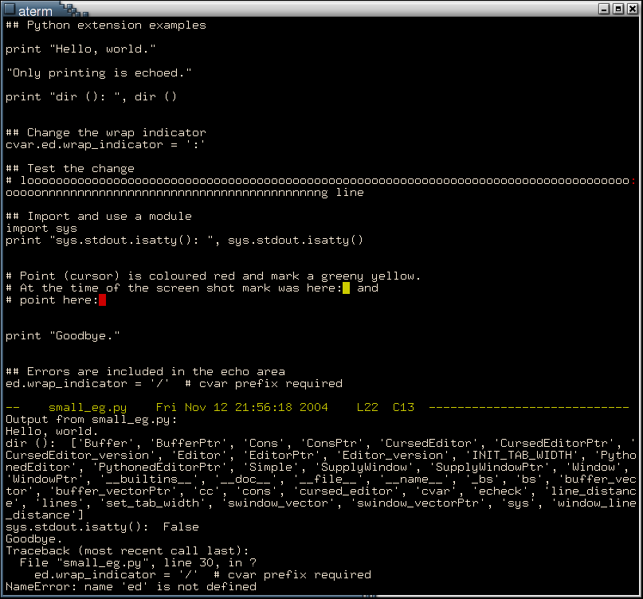

Cruse is a very very basic Emacs-like text editor, with extensibility in Python.

All files are public domain.  Portions of some of the wrapper files
that are generated by SWIG at build time are under copyright.

For build instructions see [INSTALL](INSTALL).
For key bindings see [etc/KEYS](etc/KEYS).

Three additions can be directed into the build:

  - A small example of the CERN libraries: "C-cr" writes a thousand
    pairs of random numbers into the current buffer, and "C-cg" graphs
    distributions of the numbers.

  - Evaluation of one-line multiple precision integer expressions,
    using GMP.  With this addition "C-ci" echoes the result of the
    evaluation of the expression on the current line.  "test/gmp"
    contains example expressions.

  - A small example of the Parma Polyhedra Library (PPL): "C-cp"
    echoes a sentence describing the polyhedron defined by the ASCII
    dump in the current buffer.  The "test/ppl-*" files contain
    example dumps.

### File-level summary:

Makefile
--------

    Compile with `make'.  Always links to ncurses and Python.
    Requires SWIG.  The file "INSTALL" contains further details.

Cruse.h
cruse.cc           command line interface
-----------------------------------------

    Cruse extends CursedEditor and CommandLine.  Arguments are
    processed via CommandLine.

    Usage: cruse [OPTION]... FILE_NAME

CommandLine.h      command line processing
------------------------------------------

    Generic class for command line option processing.

Editor.h
Editor.cc
PythonedEditor.h
PythonedEditor.cc
CursedEditor.h
CursedEditor.cc    the editor
-----------------------------

    Editor is an abstract class.  An Editor can contain Buffers and
    SupplyWindows, and contains a ConsT<Cons> to hold the clip ring.
    The clip ring is a history of clips (a.k.a. cuts and kills) and
    copies.

    PythonedEditor extends Editor, adding evaluation of buffers and
    regions of buffers by the Python interpreter.

    CursedEditor extends PythonedEditor, using curses to render the
    display.

Window.h
SupplyWindow.h
SupplyWindow.cc    basis for screen partitioning
------------------------------------------------

    A Window contains a Buffer.  SupplyWindow extends Window,
    supplying successive visible characters to a caller.

Buffer.h
Buffer.cc
CERNBuffer.h       file buffer
------------------------------

    A Buffer contains the characters from a file as a Cons list,
    providing an interface for manipulating and saving the file's
    sequence of characters.

    CERNBuffer extends Buffer, adding a member function to insert
    pairs of random floats into the buffer.

Cons.h
Cons.cc            simple Lisp-like linked list contruct
--------------------------------------------------------

    Conses are two part constructs that can be chained together to
    form lists.

    ConsT is a template for defining a cons class with a car (value)
    which points to a given type.  The type Cons (as used by Buffer)
    is ConsT<void>.

    BasicCons extends Cons, leaving freeing of any linked constructs
    to the caller.  It is only used in the tests.

test-Buffer.cc
test-Cons.cc
printCons.h        tests
------------------------

    `make test' compiles and runs two test programs that use and print
    Buffer and Cons objects.

bindables.h
bindables.cc       bindable functions
-------------------------------------

    Wrapper functions, for binding to key sequences.

editing.py         editing extensions
-------------------------------------

    A few Python functions which extend the editor.
